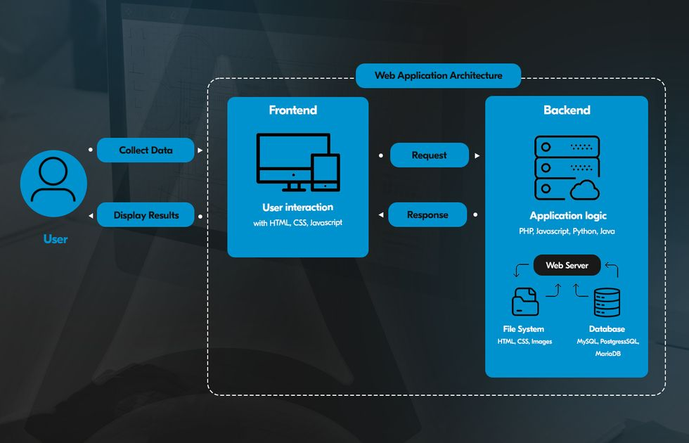
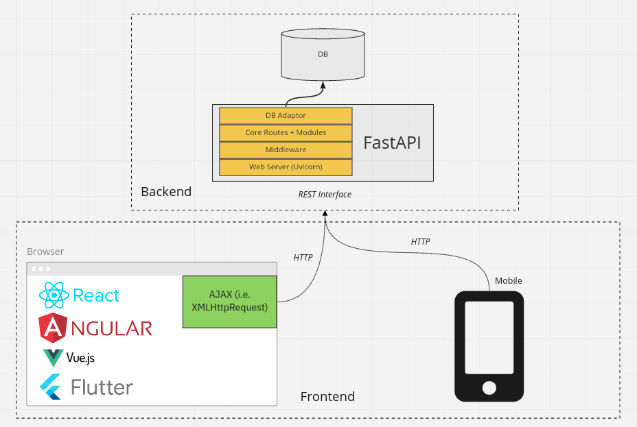
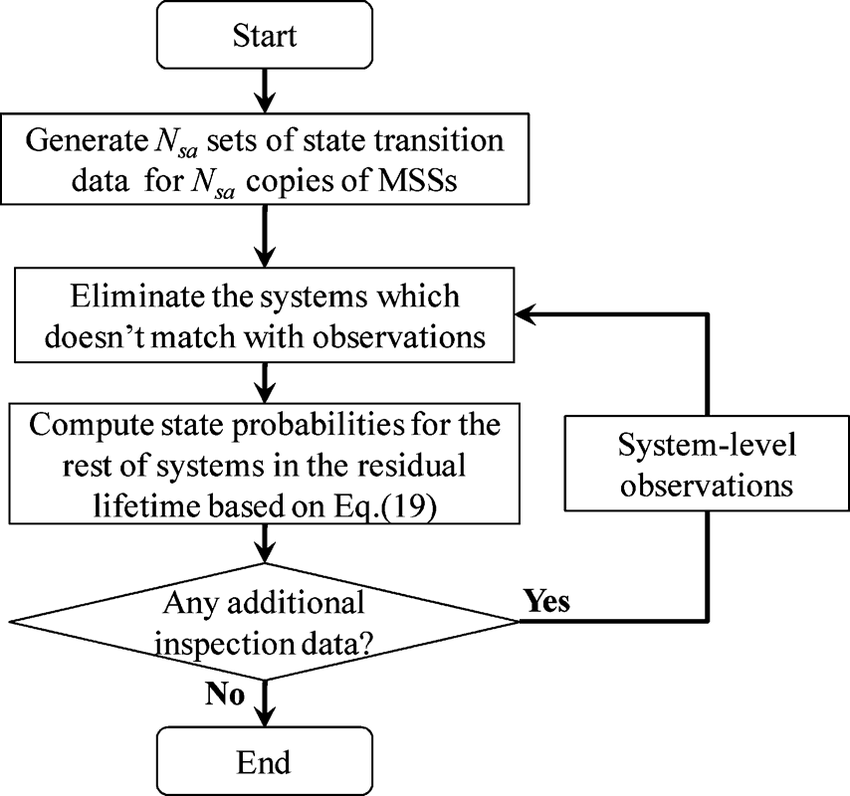
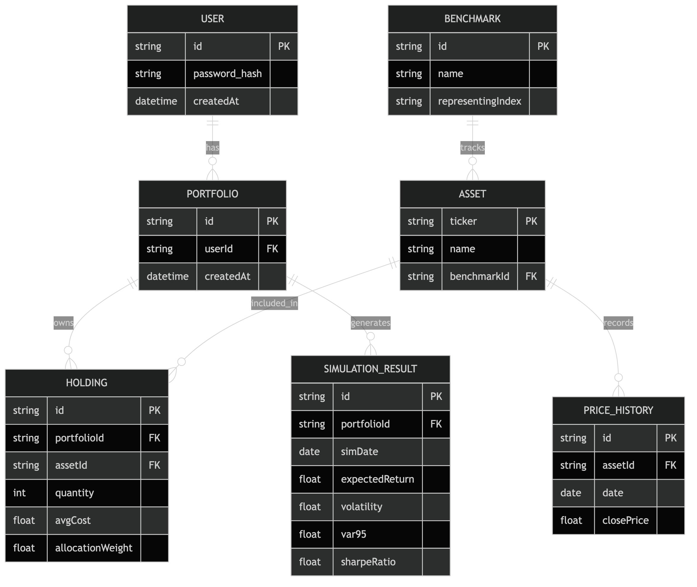
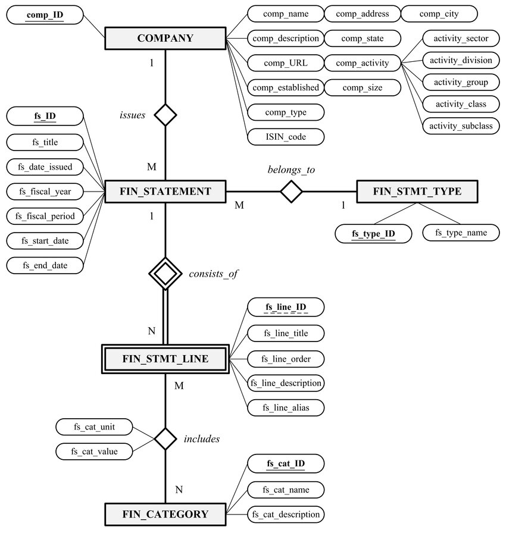
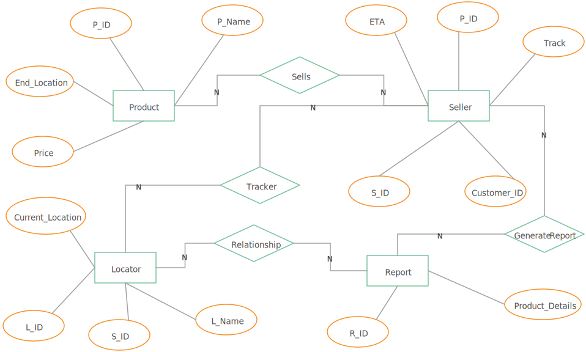
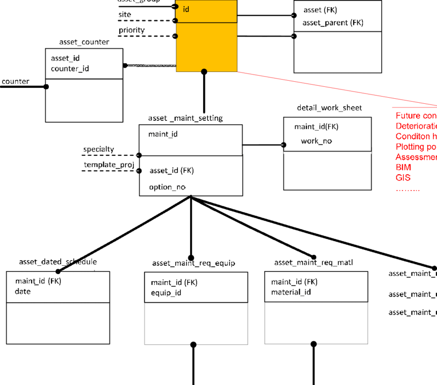

Deployed link - https://stock-portfolio-risk-analyzer-fqnb.vercel.app/

Google Drive link - https://drive.google.com/drive/folders/1C63yAESvR9UWoRjQlnKN0ehKUZBYVcVC?usp=sharing

# Stock Portfolio Risk Analyzer

A professional-grade web application that enables retail investors to analyze portfolio risk using statistical finance models including Monte Carlo Value at Risk (VaR), Sharpe Ratio, beta, and correlation analysis.

---

## 1. Problem Statement

### Problem Title

Professional Risk Analytics for Retail Investors

### Problem Description

Retail investors increasingly manage diversified portfolios but lack accessible tools to evaluate portfolio risk using professional metrics. Most decisions are based on intuition and simple return tracking rather than structured risk analysis such as Value at Risk (VaR), Sharpe Ratio, beta, and correlation matrices.

### Target Users

* Retail investors
* Finance students
* Early-stage portfolio managers
* Trading enthusiasts
* Academic researchers

### Existing Gaps

* No integrated lightweight web tool for portfolio-level risk analytics
* Limited access to Monte Carlo simulations for retail users
* Lack of interactive visualization for diversification analysis
* Overreliance on daily gains/losses instead of statistical metrics

---

## 2. Problem Understanding & Approach

### Root Cause Analysis

Retail investors lack tools due to:

* Complexity of statistical implementation
* Matrix-heavy financial computations
* Computational cost of simulations
* Poor UX in existing quant tools

### Solution Strategy

We build a web-based risk analytics engine that:

* Accepts portfolio price data via CSV
* Implements mathematically correct statistical models
* Performs Monte Carlo simulations using multivariate normal sampling
* Visualizes results in an interactive dashboard
* Provides interpretable outputs rather than raw numbers

---

## 3. Proposed Solution

### Solution Overview

A full-stack web application that processes historical price data and computes professional risk metrics including:

* Historical VaR
* Parametric (Variance-Covariance) VaR
* Monte Carlo VaR
* Sharpe Ratio
* Portfolio Volatility
* Beta
* Correlation Matrix

### Core Idea

Use statistical finance models (not predictive AI) to provide structured portfolio risk analytics in a deployable web platform.

### Key Features

* CSV upload for portfolio holdings
* Monte Carlo simulation using Cholesky decomposition
* Interactive risk dashboards
* Scenario analysis (e.g., asset drop shock testing)
* Correlation heatmap visualization
* Risk-adjusted performance metrics

---

## 4. System Architecture

### High-Level Flow

User → Frontend → Backend → Risk Engine → (Optional Database) → Response → Visualization

### Architecture Description

1. User uploads CSV from frontend
2. Frontend sends file to FastAPI backend
3. Backend:

   * Parses CSV
   * Computes returns
   * Calculates covariance matrix
   * Runs Monte Carlo simulation
   * Computes VaR and performance metrics
4. Backend returns JSON response
5. Frontend renders dashboards and charts

### Architecture Diagram

---

## 5. Database Design

### ER Diagram

### ER Diagram Description

Entities:

* User
* Portfolio
* Asset
* Historical Prices
* Risk Metrics

Relationships:

* One user → Many portfolios
* One portfolio → Many assets
* One asset → Many historical price records

---

## 6. Dataset Selected

### Dataset Name

Custom Portfolio Historical Price Dataset (CSV-based)

### Source

User-provided CSV file (historical adjusted closing prices)

### Data Type

Time-series numerical financial data

### Selection Reason

* Ensures deterministic demo
* No API dependency
* Stable for hackathon environment

### Preprocessing Steps

* Date parsing
* Sorting chronologically
* Return calculation
* NaN removal
* Covariance computation

---

## 7. Model Selected

### Model Name

Multivariate Normal Monte Carlo Simulation for Portfolio Risk

### Selection Reasoning

* Industry-standard risk estimation approach
* Captures asset correlations
* Scalable for multiple assets
* Computationally efficient with NumPy

### Alternatives Considered

* GARCH models
* Bootstrapping methods
* Historical-only VaR
* Machine learning predictors

### Evaluation Metrics

* Portfolio volatility
* 95% VaR
* Sharpe Ratio
* Simulation stability
* Correlation structure validation

---

## 8. Technology Stack

### Frontend

* React (Vite)
* Tailwind CSS
* Recharts / Chart.js

### Backend

* FastAPI
* Uvicorn

### ML/AI

* NumPy
* Pandas
* SciPy

### Database

* Optional: PostgreSQL (Production)
* Hackathon: In-memory processing

### Deployment

* Frontend: Vercel
* Backend: Render

---

## 9. API Documentation & Testing

### API Endpoints List

* **POST /upload**

  * Upload CSV file

* **POST /analyze**

  * Compute portfolio metrics

* **POST /simulate**

  * Run Monte Carlo simulation

### API Testing Screenshots

---

## 10. Module-wise Development & Deliverables

### Checkpoint 1: Research & Planning

* Financial model documentation
* Risk formula validation
* Architecture design

### Checkpoint 2: Backend Development

* CSV parser
* Returns calculator
* Covariance matrix computation
* Sharpe Ratio module
* VaR implementations

### Checkpoint 3: Frontend Development

* CSV upload UI
* Dashboard layout
* Risk metric cards
* Charts

### Checkpoint 4: Model Training

### Checkpoint 5: Model Integration

* API connection
* JSON response parsing
* Visualization integration

### Checkpoint 6: Deployment

* Backend deployment on Render
* Frontend deployment on Vercel
* Environment configuration

---

## 11. End-to-End Workflow

1. User uploads CSV
2. Backend parses and validates data
3. Returns are computed
4. Covariance matrix calculated
5. Portfolio volatility derived
6. Monte Carlo simulation executed
7. VaR and Sharpe metrics computed
8. JSON response returned
9. Frontend renders risk dashboard

---

## 12. Demo & Video

* Live Demo Link:
* Demo Video Link:
* GitHub Repository:

---

## 13. Hackathon Deliverables Summary

* Fully deployed web application
* Monte Carlo-based VaR engine
* Interactive risk dashboard
* Professional statistical implementation

---

## 14. Team Roles & Responsibilities

| Member Name | Role                  | Responsibilities                                          |
| ----------- | --------------------- | --------------------------------------------------------- |
| Krishna Verma    | Backend & Risk Engine | Statistical modeling, FastAPI, Monte Carlo implementation |
| Sambuddha Banerjee    | Frontend              | UI/UX, dashboard visualization                            |
| Aniruddha Dwivedi    | Core logic and Ideation  | Researching about various possible methods of Portfolio Analysis                         |

---

## 15. Future Scope & Scalability

### Short-Term

* Add benchmark comparison
* Add scenario analysis sliders
* Add downloadable reports

### Long-Term

* Live market data integration
* Advanced volatility models (GARCH)
* Portfolio optimization module
* Risk stress testing engine
* Multi-user authentication system

---

## 16. Known Limitations

* Assumes normal distribution for returns
* No transaction cost modeling
* No live market data integration
* No liquidity risk modeling

---

## 17. Impact

* Enables data-driven investment decisions
* Improves financial risk awareness
* Democratizes professional risk analytics
* Bridges gap between retail investing and quantitative finance
